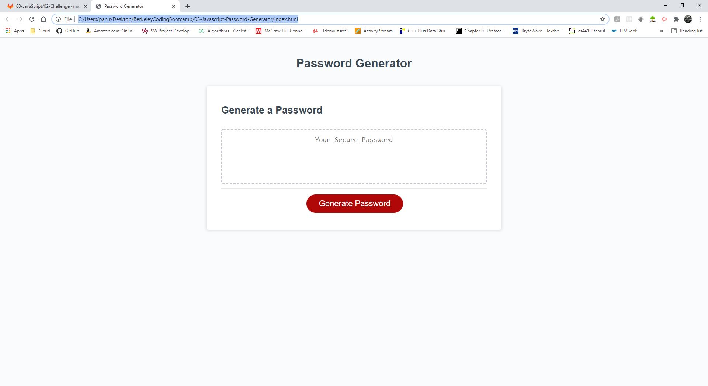

# 03 JavaScript: Password Generator
Create an application that generates a random password based on user-selected criteria. This app will run in the browser and feature dynamically updated HTML and CSS powered by your JavaScript code. It will also feature a clean and polished user interface and be responsive, ensuring that it adapts to multiple screen sizes.

If you are unfamiliar with special characters, take a look at [some examples](https://www.owasp.org/index.php/Password_special_characters).

## Links (https://anirud314.github.io/Password-Generator/) if that doesn't work (https://anirud314.github.io/Password-Generator/index.html)
I published the page at: https://anirud314.github.io/Password-Generator/
But as of 7:06pm on April 11th for some weird reason it is not working, I tried looking up troubleshooting stuff on the internet but lots of articles said either to wait until some point or that it was fixed before people could pinpoint what went wrong.
A solution I found was to put index.html at the end of the url so to test I have been doing this.
https://anirud314.github.io/Password-Generator/index.html

----Update As of 7:11pm both links work on my computer

## Write Up and notes
### Basic Summary of the project
This project is about utilizing what we learned from module 3 in order to work on the behavior of an application, in this instance we are looking at the behavior of a password generator. This assignment gives us a user story and a acceptance criteria that boils down to building a random password generator that takes a user input of the size of the password based on some parameters and if the user wants or doesn't want to utilize select characters for the password. 
### What I did
I first started off defining two global values that I knew I would need. A function for random number which I got from our practice in module three, I tweaked it a bit because we can utilize 0 in this project. I also created an array with 4 nested arrays within it called charCheckArray, charCheckArray holds 4 arrays and each array has a different set of characters that can be utilized to make a random password. the array in charCheckArray[0] holds lowercase letters; the array in charCheckArray[1] holds uppercase letters; the array in charCheckArray[2] holds numbers; the array in charCheckArray[3] holds symbols.

In order to move forward I decided to break down the functionality into two main parts. The first part is assigning a length for the password. I did this in the parameterNumChecker function. The next functionality is randomly generating a password of that length which is done in the function parameterValChecker. I split these functions apart in order to make the code easier to read by having each function do a certain task rather than just do everything in generatePassword().

From there I started by creating the parameterNumChecker function which called a prompt that asked a user for a number for how long the password is meant to be. Details about how the code works are commented in the correct places in the code. This function returns a value for the size of the password if inputted correctly. If an incorrect input is placed in the prompt the function will alert the user that they can only put in an input that is valid(in this instance a input of a numerical value between 8-128) or if the user doesn't want to input the value they put in initially there is a confirm prompt that allows the user to choose if they want to use the value they put in or not. If the user has an incorrect input or if the user chooses to not keep the value they inputted the function returns a recursive call back onto the parameterNumChecker function which allows the user to keep trying to input a value for the length of the password until they are satisfied or until they get it correct.

Once the value is inputted the parameterNumChecker returns the function to the generatePassword function which assigns it to a variable called charSize. generatePassword then calls the parameterValChecker and passes the charSize variable to the parameterValChecker function

The parameterValChecker is where most of the meat and potatoes of the programs functionallity is. For starters I would like to once again point out that I commented details about what the code is doing inside the script.js file itself. Now to summarize what this function is doing, the parameterValChecker initializes 3 variables, a empty array called charArray, another empty array called createdPwArray, and a empty variable called createdPw. After that it prompts the user using window.confirm 4 times asking the user if they want to use lowercase, uppercase, numerical/numbers and/or symbols. The user answers either ok or cancel to all of these prompts. after these values are saved in their respective variables the function checks if any of the four answered confirm prompt variables are true(the user answers ok === true). If the user answered ok to any of these than the function will push a corresponding array from charCheckArray to charArray, Ex: if user says ok to lower case then the checkLowerCase variable is true which means that charCheckArray[0] will be pushed into the charArray using a for loop. This is the case for the other 3 confirm prompts as well. However, if the user says cancel (false) to all four confirm prompts than the program will alert the user that they can not do that and return a recursive call to the parameterValChecker. Once the user has an input that is valid the function populates the createdPwArray utilizing the charArray that was created earlier and using a for loop to iterate and add to the createdPwArray based on the lengthOfPw value that was passed into the function in generatePassword. Once that is done the function uses the createdPwArray.join('') to create a single value that is assigned to the createdPw variable which is returned from this function to the generatedPassword function.

from there the generatedPassword function assigns the value returned to it from parameterValChecker as a variable called generatedPw, and then generatedPassword returns generatedPw to the already built writePassword function which assigns the value to variable password which in turn uses a query selector to change the text of the textArea in the html into the password value we got from generatedPassword.

### A couple notes
One of the issues I had was trying to recursively call my functions back on itself in order to allow the user multiple attempts to get the correct input. I learned through external research that I have to return a recursive call in the code in order for it to work properly. I however do not really understand the concept that well and plan to go to office hours at some point or ask the teacher about it. 
The reference I used is here: 
https://www.javascripttutorial.net/javascript-recursive-function/
https://www.programiz.com/javascript/recursion
https://javascript.info/recursion

I initially was planning to utilize an object full of arrays instead of an array with nested arrays, but after a little bit more reading I felt that this may be an easier approach considering the problem. Here is the reference I used to learn more about nested arrays:
https://www.elated.com/nested-arrays-in-javascript/

### ScreenShots of working Application
This is a set of screenshots that I took when testing the application, all of this was done in one go.



--------------------------------------------------------------------------------------------------------------------
## User Story

```
AS AN employee with access to sensitive data
I WANT to randomly generate a password that meets certain criteria
SO THAT I can create a strong password that provides greater security
```

## Acceptance Criteria

```
GIVEN I need a new, secure password
WHEN I click the button to generate a password
THEN I am presented with a series of prompts for password criteria
WHEN prompted for password criteria
THEN I select which criteria to include in the password
WHEN prompted for the length of the password
THEN I choose a length of at least 8 characters and no more than 128 characters
WHEN prompted for character types to include in the password
THEN I choose lowercase, uppercase, numeric, and/or special characters
WHEN I answer each prompt
THEN my input should be validated and at least one character type should be selected
WHEN all prompts are answered
THEN a password is generated that matches the selected criteria
WHEN the password is generated
THEN the password is either displayed in an alert or written to the page
```

The following image demonstrates the application functionality:


## Review

You are required to submit the following for review:

* The URL of the deployed application.

* The URL of the GitHub repository. Give the repository a unique name and include a README describing the project.

- - -
© 2021 Trilogy Education Services, LLC, a 2U, Inc. brand. Confidential and Proprietary. All Rights Reserved.
